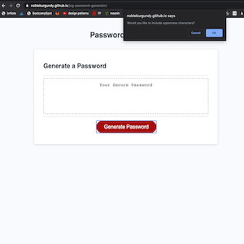
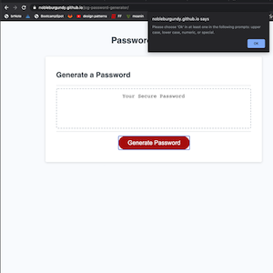
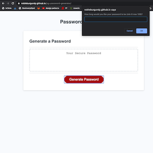
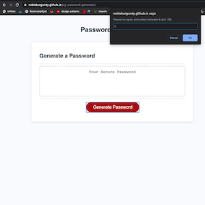
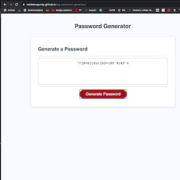

# Password Generator

## Description

This is a password generator that prompts the user for the password parameters. The parameters are at least one of the following: lower case, upper case, numeric, and speical characters based on the accepted standard from the [OWASP Foundation](https://www.owasp.org/index.php/Password_special_characters0). The user is also prompted for the length of the password between 8 and 128 characters.

## Images

First Prompt:

Upper Case/Lower Case/Numeric/Special Character Missing Prompt:

Password Length Prompt:

Password Length Error:

Password Generation Example:

## Link

You can find the deployed application of this site [here](https://nobleburgundy.github.io/jcg-password-generator).
